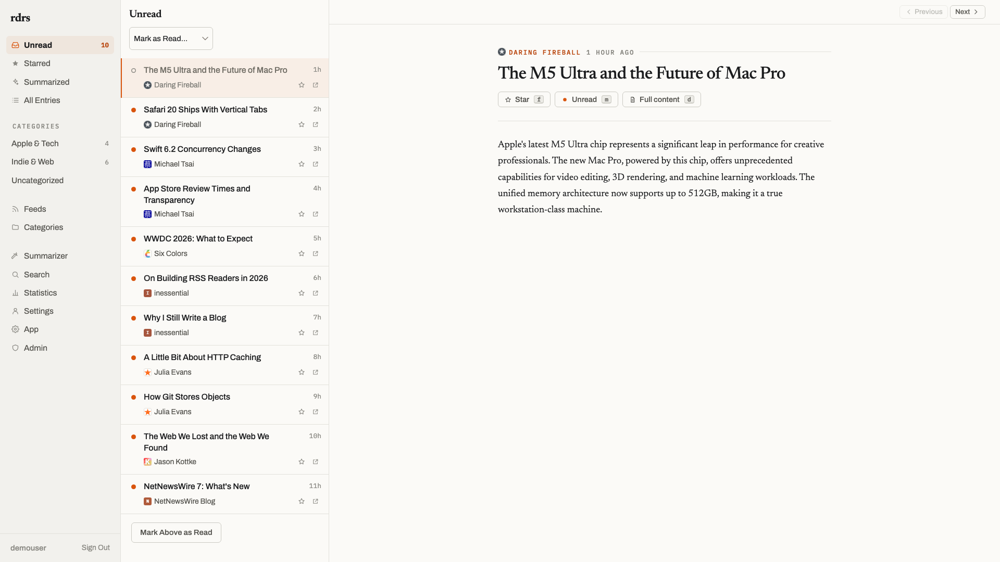
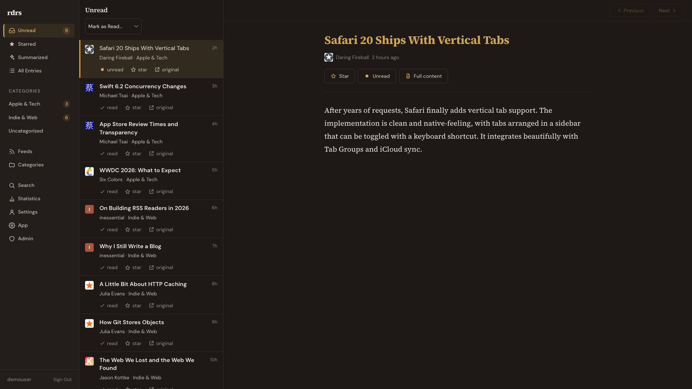
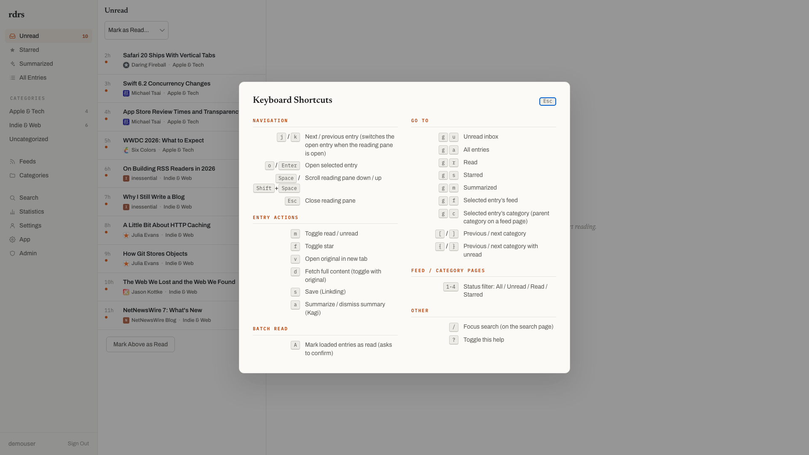
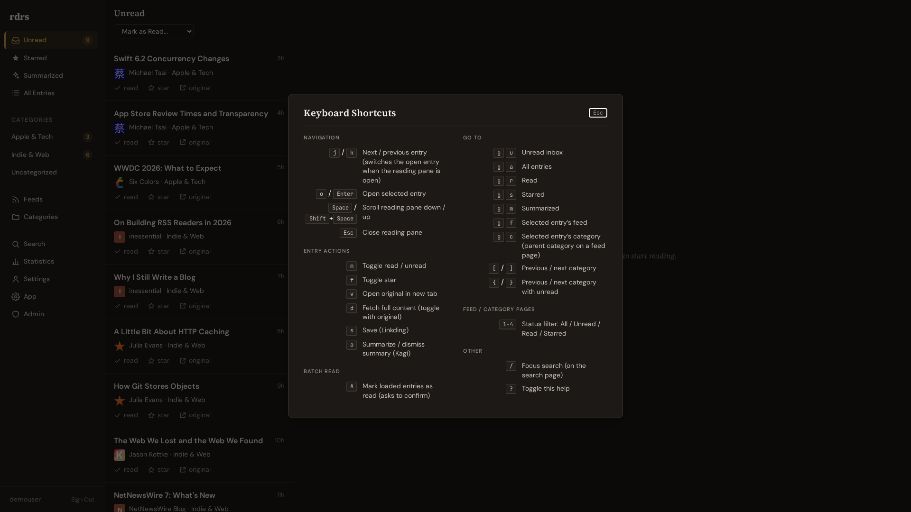

# RDRS - RSS Reader in Rust

> A self-hosted RSS/Atom feed reader built with Rust.

[](https://github.com/henry40408/rdrs/actions/workflows/ci.yml)
[](https://codecov.io/gh/henry40408/rdrs)
[](https://github.com/henry40408/rdrs/releases/latest)
[](LICENSE.txt)
[](https://www.rust-lang.org/)
[](https://ghcr.io/henry40408/rdrs)
[](https://casuallymaintained.tech/)
[](https://claude.com/claude-code)

Privacy-focused, lightweight, and designed for personal use.

| Light | Dark |
|-------|------|
|  |  |
|  |  |

## Features

- **Feed Management** - Subscribe to RSS/Atom feeds, organize into categories, OPML import/export
- **Reading Experience** - Mark read/unread, star entries, full-text search, keyboard shortcuts
- **Privacy Protection** - HTML sanitization, tracking URL removal, image proxy
- **Full Content Extraction** - Fetch complete article content using readability algorithm
- **AI Summarization** - Automatic article summaries via Kagi AI integration
- **WebAuthn/Passkey** - Passwordless authentication with passkey support
- **External Services** - Save entries to Linkding bookmark manager
- **Google Reader API** - Compatible with GReader clients (FeedMe, Read You, etc.)
- **Multi-User Support** - Role-based access control with admin panel
- **Docker Ready** - Single-binary deployment with all assets embedded, multi-platform container images

## Quick Start

### Using Docker (Recommended)

```bash
docker run -d \
  --name rdrs \
  -p 8080:8080 \
  -v rdrs_data:/data \
  -e RDRS_SIGNUP_ENABLED=true \
  -e RDRS_SECRET="$(openssl rand -base64 32)" \
  ghcr.io/henry40408/rdrs:latest
```

Visit `http://localhost:8080` and create your account.

> **`RDRS_SECRET`** — if left unset, a random secret is generated on
> each startup, which invalidates every previously-proxied image URL whenever
> the container restarts. Set it to a persistent value (e.g.
> `openssl rand -base64 32`) so proxied images survive restarts.

### Building from Source

```bash
# Clone repository
git clone https://github.com/henry40408/rdrs.git
cd rdrs

# Build release binary
cargo build --release

# Run server
./target/release/rdrs
```

Visit `http://localhost:8080` and create your account. The **first account is
always allowed** even when `RDRS_SIGNUP_ENABLED=false` (the default), so a source
build works out of the box. `RDRS_SIGNUP_ENABLED` (together with
`RDRS_MULTI_USER_ENABLED`) only governs *additional* registrations after the first
account exists.

## Configuration

All configuration is done via environment variables.

> **Upgrading from a release before the `RDRS_` prefix?** Every rdrs-specific
> variable gained an `RDRS_` prefix, and `IMAGE_PROXY_SECRET` became
> `RDRS_SECRET`. The old names are **no longer read**, and rdrs **refuses to
> start** while any of them is still set, listing each one and its replacement.
>
> The refusal is deliberate. Ignoring the old names would start a perfectly
> healthy server on defaults — against an empty `rdrs.sqlite3` rather than your
> database, with signup off and a regenerated secret. Failing once, loudly, is
> the cheaper outcome.
>
> `DATABASE_URL` is the exception and keeps its bare name: it is a genuine
> cross-tool convention. The rest only looked generic — `USER_AGENT` and
> `SERVER_BIND` were rdrs's own names all along, which is exactly what made them
> collide with other services in a shared compose file. `RUST_LOG` and
> `NO_COLOR` are likewise untouched.

| Variable | Default | Description |
|----------|---------|-------------|
| `DATABASE_URL` | `rdrs.sqlite3` | Database location. A file path or `sqlite://` URL selects SQLite (zero-config default); a `postgres://` URL selects PostgreSQL. The backend is chosen once at startup. |
| `RDRS_SERVER_BIND` | `127.0.0.1:8080` | HTTP server bind address (`host:port`). Defaults to loopback so a bare-metal run is not exposed on all interfaces without opting in; the container image sets `0.0.0.0:8080` so a reverse proxy can reach it. |
| `RDRS_SIGNUP_ENABLED` | `false` | Allow new user registration |
| `RDRS_MULTI_USER_ENABLED` | `false` | Allow multiple users (requires signup enabled) |
| `RDRS_SECRET` | Auto-generated | HMAC secret for secure image proxying |
| `RDRS_PUBLIC_BASE_URL` | - | Public base URL for generating absolute image proxy URLs in API responses (e.g., `https://rdrs.example.com`). If not set, relative paths are used (backward compatible). |
| `RDRS_COOKIE_SECURE` | Derived from `RDRS_PUBLIC_BASE_URL` | Send the session cookie with the `Secure` attribute (HTTPS only). Defaults to on when `RDRS_PUBLIC_BASE_URL` starts with `https://`, off otherwise — so an HTTPS deployment is secure without a second setting, while a plain-HTTP dev run keeps working. Set `true`/`1` to force it on when TLS terminates upstream and `RDRS_PUBLIC_BASE_URL` is unset; set `false`/`0` to force it off. Only those four values are accepted — anything else fails startup rather than silently disabling `Secure`. |
| `RDRS_USER_AGENT` | `RDRS/...` | Custom user agent for feed fetching |
| `RDRS_WEBAUTHN_RP_ID` | `localhost` | WebAuthn Relying Party ID for passkey authentication |
| `RDRS_WEBAUTHN_RP_ORIGIN` | `http://localhost:{port}` | WebAuthn Relying Party origin URL |
| `RDRS_WEBAUTHN_RP_NAME` | `rdrs` | WebAuthn Relying Party display name |
| `RUST_LOG` | - | Log level filter (e.g., `info`, `debug`, `rdrs=debug`). When unset, defaults to `error,rdrs=info` (rdrs' own INFO logs are visible; other crates stay at ERROR). |
| `RDRS_LOG_FORMAT` | `full` | Log output format: `full`, `compact`, `pretty`, or `json`. Can also be set via `--log-format`. |
| `RDRS_AUTH_PROXY_HEADER` | - | Header carrying the username from a forward-auth proxy (e.g. `Remote-User`, `X-Forwarded-User`). Empty disables the feature. |
| `RDRS_TRUSTED_PROXY_NETWORKS` | - | Comma-separated CIDRs or bare IPs (e.g. `10.0.0.0/8, 192.168.1.5`). The TCP peer IP must fall within one of these for the identity header to be trusted. Required when `RDRS_AUTH_PROXY_HEADER` is set. |
| `RDRS_AUTH_PROXY_USER_CREATION` | `false` | When `true`, JIT-create a local account for an unknown proxy-provided username instead of redirecting to `/login`. |
| `RDRS_AUTH_PROXY_GROUPS_HEADER` | - | Header carrying comma-separated group names from the proxy (e.g. `Remote-Groups`). |
| `RDRS_AUTH_PROXY_ADMIN_GROUP` | - | Membership in this group grants the admin role, synced on every forward-auth login. Active only when `RDRS_AUTH_PROXY_GROUPS_HEADER` is also set. |
| `RDRS_DISABLE_LOCAL_AUTH` | `false` | Hides the browser password form and rejects `POST /api/session` with 403. Does not affect GReader API or passkey auth. Requires `RDRS_AUTH_PROXY_HEADER`. |
| `RDRS_AUTH_PROXY_LOGOUT_URL` | (unset) | When set, Sign Out redirects the browser here (e.g. the Authelia logout URL) to end the SSO session. When unset, Sign Out clears the local session and the proxy header re-authenticates on the next request (you return to the app). |

> **Deploying behind a domain?** `RDRS_WEBAUTHN_RP_ID` and `RDRS_WEBAUTHN_RP_ORIGIN`
> default to `localhost` and **must** be overridden to your public host (e.g.
> `RDRS_WEBAUTHN_RP_ID=rdrs.example.com`,
> `RDRS_WEBAUTHN_RP_ORIGIN=https://rdrs.example.com`), otherwise the browser rejects
> passkeys. rdrs logs a startup warning while the RP origin still points at
> `localhost`, and the active values are shown on the Settings page.

## Authentication & SSO

RDRS supports three authentication methods that all work simultaneously by
default: local password, WebAuthn/passkeys, and **forward-auth (trusted-header)
SSO**. `RDRS_DISABLE_LOCAL_AUTH` is the only knob that narrows this set.

### Forward-Auth (SSO)

RDRS can delegate browser login to an external forward-auth proxy such as
Authelia, authentik, or Traefik ForwardAuth. The proxy authenticates the user
and forwards their identity in a trusted header; RDRS establishes a session from
it. Existing accounts are matched by username — no migration is required.

**Enable it** by setting (see the [Configuration](#configuration) table for all
fields):

- `RDRS_AUTH_PROXY_HEADER` — the username header your proxy injects (e.g.
  `Remote-User`).
- `RDRS_TRUSTED_PROXY_NETWORKS` — the CIDR(s)/IP(s) the proxy connects from. The
  identity header is trusted only when the TCP peer falls within this set, so it
  cannot be spoofed by a downstream client.

**Optional:** `RDRS_AUTH_PROXY_USER_CREATION` (JIT-create unknown users),
`RDRS_AUTH_PROXY_GROUPS_HEADER` + `RDRS_AUTH_PROXY_ADMIN_GROUP` (map a group to the admin
role on every login), `RDRS_DISABLE_LOCAL_AUTH` (hide the password form), and
`RDRS_AUTH_PROXY_LOGOUT_URL` (redirect Sign Out to your IdP's logout endpoint to also
end the SSO session; when unset, Sign Out clears the local session and the proxy
header re-authenticates on the next request).

**Reverse-proxy requirements:**

1. The proxy **must** authoritatively set — and strip any client-supplied copy
   of — the identity (and groups) headers on every request before forwarding to
   RDRS. A downstream client able to inject these headers bypasses the trust
   model entirely.
2. The proxy **must** be configured to bypass forward-auth for the paths that
   are reached without a browser SSO session — they authenticate by their own
   means (or need none), so an SSO gate breaks them without adding any security:
   - The Google Reader API paths — `/accounts/ClientLogin`, `/reader/api/...`,
     and the FreshRSS-compatible `/api/greader.php/...` prefix — so native
     GReader clients (FeedMe, Read You, etc.) can still authenticate with their
     stored username and password. These paths authenticate via the GReader
     `ClientLogin` token, not the proxy header.
   - The signed image proxy `/api/proxy/...`. Proxied `` requests are
     issued without the browser's SSO session (GReader clients render article
     images with no cookie at all), so an SSO-gated proxy path returns the login
     page instead of the image and **pictures break**. Exposing it is safe:
     every proxy URL carries an HMAC-SHA256 signature that RDRS verifies, so the
     signature — not the SSO session — authenticates each request.
   - The health endpoint `/health`, if you run liveness / uptime probes through
     the proxy. Probes carry no SSO session, so a catch-all policy makes them
     fail and can flap your orchestrator's health checks. (It needs no rule if
     you point probes straight at the container. Note `/health` returns the app
     status and build version unauthenticated, so scope the rule to your
     monitoring source if that disclosure matters.)

   Everything else stays behind SSO. In particular, do **not** bypass
   `/api/feeds/{id}/icon`: that endpoint is guarded by RDRS's own session
   check, so a bypass would only strip a defense layer — native GReader clients
   still cannot load those icons (they have no browser session), which is a
   pre-existing limitation, not a forward-auth one.

   Example Authelia access-control rules:

   ```yaml
   access_control:
     rules:
       - domain: rdrs.example.com
         policy: bypass
         resources:
           - '^/accounts/ClientLogin$'
           - '^/reader/api/.*'
           - '^/api/greader\.php/.*'   # FreshRSS-compatible prefix
           - '^/api/proxy/.*'          # HMAC-signed image proxy (avoids broken images)
           - '^/health$'               # liveness / uptime probes (no SSO session)
       - domain: rdrs.example.com
         policy: one_factor            # everything else goes through SSO
   ```

> The trust model, middleware mechanics, and how the auth mode is detected per
> request are documented in
> [ARCHITECTURE.md](ARCHITECTURE.md#forward-auth-trusted-header-login).

## Usage

### Adding Feeds

1. Navigate to the Feeds page
2. Enter the feed URL (RSS/Atom feed or webpage with feed link)
3. RDRS will auto-discover the feed and fetch metadata

### Keyboard Shortcuts

The interface supports vim-style keyboard navigation for efficient reading.

### OPML Import/Export

- **Export**: Download all your feeds as an OPML file from Settings
- **Import**: Upload an OPML file to bulk-add feeds

### AI Summaries

RDRS can generate per-article summaries via the Kagi Universal Summarizer. This
is configured per user:

1. Go to Settings → Kagi Universal Summarizer
2. Paste your Kagi session link and choose a target language
3. Summaries are then generated on demand for entries

### Linkding Integration

Connect RDRS to your Linkding instance to save articles for later:

1. Go to Settings
2. Enter your Linkding URL and API token
3. Use the "Save" button on any entry

## Docker

### Docker Compose

```yaml
services:
  rdrs:
    image: ghcr.io/henry40408/rdrs:latest
    ports:
      - "8080:8080"
    volumes:
      - rdrs_data:/data
    environment:
      - RDRS_SIGNUP_ENABLED=true
      - RDRS_SECRET=your-secret-here
    restart: unless-stopped

volumes:
  rdrs_data:
```

### Building Docker Image

```bash
docker build -t rdrs:latest .
```

The Dockerfile uses multi-stage builds with a distroless base image for minimal
size and attack surface. The build-stage design is described in
[ARCHITECTURE.md](ARCHITECTURE.md#deployment).

### Production Notes

- Set `RDRS_SECRET` to a persistent value so image proxy URLs survive
  restarts (otherwise it is auto-generated on each boot).
- Mount the `/data` volume so the SQLite database persists.
- Put RDRS behind a reverse proxy for TLS termination.

## Development

### Prerequisites

- Rust 1.96 (pinned via `rust-toolchain.toml`; rustup installs it automatically)
- SQLite (bundled via rusqlite)

### Running Tests

```bash
cargo nextest run
```

### Project Structure

See [ARCHITECTURE.md](ARCHITECTURE.md) for detailed architecture documentation.

## Tech Stack

- **Web Framework**: Axum 0.8
- **Async Runtime**: Tokio
- **Database**: SQLite (rusqlite)
- **Templates**: Askama
- **Feed Parsing**: feed-rs
- **HTML Sanitization**: Ammonia
- **Content Extraction**: Readability

## License

MIT
